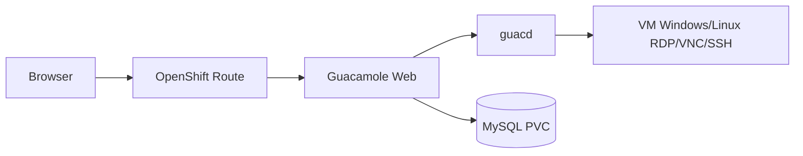

# Guacamole Operator for OpenShift

Operator Kubernetes/OpenShift para implantar **Apache Guacamole** de forma declarativa no Red Hat OpenShift. Baseado na implementação de referência [guacamole-rdp](https://github.com/raphaelmorsch/guacamole-rdp).

Para cada recurso customizado `Guacamole`, o operator provisiona automaticamente:

- **MySQL** com armazenamento persistente
- **guacd** (proxy RDP/VNC/SSH)
- **Guacamole web** com inicialização automática do schema do banco
- **Route OpenShift** para acesso via browser

A implantação é **rootless** e respeita as Security Context Constraints (SCC) do OpenShift.

## Arquitetura



---

## Pré-requisitos

| Ferramenta | Versão mínima | Observação |
|---|---|---|
| OpenShift | 4.x | Acesso `cluster-admin` para instalar via OLM |
| `oc` | — | Autenticado no cluster |
| `go` | 1.21+ | Compilar o operator |
| `make` | — | Targets do projeto |
| `podman` | — | Build e push de imagens (use Podman de ponta a ponta) |
| `operator-sdk` | 1.37+ | Gerar bundle OLM |
| OLM | — | Já presente em clusters OpenShift |

> **Apple Silicon (M1/M2/M3):** clusters OpenShift usam `amd64`. Sempre build de imagens com `--platform linux/amd64`.

---

## Tutorial completo — do zero ao Operator Hub

Este tutorial reflete o fluxo **testado e validado** em um Mac M1 com Podman e OpenShift 4.x.

### Visão geral das fases

| Fase | O que faz | Resultado esperado |
|---|---|---|
| 1 | Compilar e buildar imagens | 3 imagens locais |
| 2 | Push para registry do OpenShift | Imagens no cluster |
| 3 | Registrar catálogo OLM | Operator no Hub |
| 4 | Corrigir imagens do deployment | CSV `Succeeded` |
| 5 | Criar instância Guacamole | Stack rodando |

---

### Fase 0 — Variáveis de ambiente

Defina uma vez e reutilize em todos os passos:

```bash
export VERSION=0.0.1
export NAMESPACE=guacamole-operator-system
```

Faça login no cluster:

```bash
oc login <API_URL> -u <USER> -p <PASSWORD>
oc whoami   # deve retornar seu usuário
```

---

### Fase 1 — Build local

```bash
git clone https://github.com/raphaelmorsch/guacamole-operator.git
cd guacamole-operator

# Compilar o binário (validação)
make build
ls -lh bin/manager
```

Build da **imagem do operator** para `amd64`:

```bash
podman build --platform linux/amd64 \
  -t guacamole.io/guacamole-operator:${VERSION} .

# Confirmar arquitetura
podman inspect guacamole.io/guacamole-operator:${VERSION} \
  --format 'Arch: {{.Architecture}}'
# Esperado: amd64
```

Gerar e buildar o **bundle OLM** (manifests + CSV):

```bash
make bundle VERSION=${VERSION} DEFAULT_CHANNEL=alpha \
  IMG=guacamole.io/guacamole-operator:${VERSION}

make bundle-build BUNDLE_IMG=guacamole.io/guacamole-operator-bundle:${VERSION} \
  CONTAINER_TOOL=podman
```

Verificar imagens locais (catalog será gerada na Fase 2):

```bash
podman images | grep guacamole
```

Esperado neste ponto:

```
guacamole.io/guacamole-operator           0.0.1
guacamole.io/guacamole-operator-bundle    0.0.1
```

---

### Fase 2 — Push para o registry do OpenShift

#### 2a. Habilitar route do registry (se necessário)

```bash
oc get route default-route -n openshift-image-registry
```

Se não existir:

```bash
oc patch configs.imageregistry.operator.openshift.io/cluster \
  --patch '{"spec":{"defaultRoute":true}}' --type=merge
```

Aguarde ~1 minuto e confirme:

```bash
export REGISTRY=$(oc get route default-route -n openshift-image-registry \
  --template='{{ .spec.host }}')
echo $REGISTRY
```

#### 2b. Criar namespace e fazer login no registry

```bash
oc new-project ${NAMESPACE}

podman login --tls-verify=false \
  -u $(oc whoami) \
  -p $(oc whoami -t) \
  default-route-openshift-image-registry.apps.<cluster>.com
```

Ou use o host retornado por `$REGISTRY`.

#### 2c. Tag e push do operator e bundle

```bash
podman tag guacamole.io/guacamole-operator:${VERSION} \
  ${REGISTRY}/${NAMESPACE}/guacamole-operator:${VERSION}
podman tag guacamole.io/guacamole-operator-bundle:${VERSION} \
  ${REGISTRY}/${NAMESPACE}/guacamole-operator-bundle:${VERSION}

podman push ${REGISTRY}/${NAMESPACE}/guacamole-operator:${VERSION}
podman push ${REGISTRY}/${NAMESPACE}/guacamole-operator-bundle:${VERSION}
```

> **Importante:** crie o namespace **antes** do push. Push sem namespace existente retorna `denied`.

#### 2d. Gerar e push da catalog image (crítico no M1)

O `bin/opm index add` sem `--generate` produz imagem `arm64` no Mac. Gere o Dockerfile e build com plataforma explícita:

```bash
bin/opm index add \
  --pull-tool podman \
  --mode semver \
  --generate \
  -d index.Dockerfile \
  --bundles ${REGISTRY}/${NAMESPACE}/guacamole-operator-bundle:${VERSION}

podman build --platform linux/amd64 \
  -f index.Dockerfile \
  -t ${REGISTRY}/${NAMESPACE}/guacamole-operator-catalog:${VERSION} .

podman inspect ${REGISTRY}/${NAMESPACE}/guacamole-operator-catalog:${VERSION} \
  --format 'Arch: {{.Architecture}}'
# Esperado: amd64

podman push ${REGISTRY}/${NAMESPACE}/guacamole-operator-catalog:${VERSION}
```

Confirmar no cluster:

```bash
oc get imagestream -n ${NAMESPACE}
```

---

### Fase 3 — Publicar no Operator Hub

#### 3a. Permitir pull do catálogo

O namespace `openshift-marketplace` precisa puxar imagens do seu namespace:

```bash
oc policy add-role-to-group system:image-puller \
  system:serviceaccounts:openshift-marketplace \
  -n ${NAMESPACE}
```

#### 3b. Aplicar CatalogSource

Use a URL **interna** do registry (funciona em qualquer OpenShift):

```bash
oc apply -f config/olm/catalogsource.yaml
```

O arquivo usa:

```yaml
image: image-registry.openshift-image-registry.svc:5000/guacamole-operator-system/guacamole-operator-catalog:0.0.1
```

Aguarde o pod do catálogo ficar `Running`:

```bash
oc get pods -n openshift-marketplace | grep guacamole
```

Esperado: `1/1 Running` (não `CrashLoopBackOff` nem `ImagePullBackOff`).

#### 3c. Instalar o operator via Subscription

```bash
oc apply -f config/olm/operatorgroup.yaml
oc apply -f config/olm/subscription.yaml
```

Verificar:

```bash
oc get packagemanifest | grep guacamole
oc get csv -n ${NAMESPACE}
```

---

### Fase 4 — Corrigir imagens do controller

O bundle gerado referencia `guacamole.io/guacamole-operator` e `kube-rbac-proxy:v0.16.0` (inexistente). Corrija no cluster:

```bash
oc set image deployment/guacamole-operator-controller-manager \
  manager=${REGISTRY}/${NAMESPACE}/guacamole-operator:${VERSION} \
  kube-rbac-proxy=quay.io/brancz/kube-rbac-proxy:v0.18.2 \
  -n ${NAMESPACE}
```

Aguarde o pod ficar pronto:

```bash
oc get pods -n ${NAMESPACE} -w
```

Esperado: `2/2 Running`.

CSV instalado:

```bash
oc get csv guacamole-operator.v${VERSION} -n ${NAMESPACE}
```

Esperado: `PHASE: Succeeded`.

---

### Fase 5 — Verificar no Web Console

1. Acesse **Operators → Operator Hub**
2. Busque **"Guacamole Operator"**
3. Deve aparecer com badge **Installed** (já instalado via Subscription)

---

### Fase 6 — Criar uma instância Guacamole

```bash
oc new-project guacamole
oc apply -f config/samples/guacamole_v1alpha1_guacamole.yaml
```

Acompanhar:

```bash
oc get guacamole -n guacamole
oc get pods -n guacamole
oc get route -n guacamole
```

Obter a URL externa:

```bash
oc get guacamole guacamole -n guacamole \
  -o jsonpath='{.status.routeURL}{"\n"}'
```

Credenciais padrão do Guacamole após primeiro acesso: `guacadmin` / `guacadmin` (altere imediatamente).

---

## Custom Resource — referência

```yaml
apiVersion: guacamole.guacamole.io/v1alpha1
kind: Guacamole
metadata:
  name: guacamole
  namespace: guacamole
spec:
  guacamoleImage: guacamole/guacamole:1.6.0
  guacdImage: guacamole/guacd:1.6.0
  mysqlImage: mysql:8.0
  replicas: 1
  database:
    storageSize: 5Gi
  route:
    enabled: true
    tlsTermination: edge
```

---

## O que NÃO fazer (lições aprendidas)

| Abordagem | Por que falha |
|---|---|
| `make docker-buildx` no M1 | Tenta 4 arquiteturas; `go mod download` falha no buildx |
| `guacamole.io/...` como registry | Host não existe — é só tag local |
| `localhost/...` sem porta | Podman interpreta como registry HTTPS na porta 443 |
| `bin/opm index add` sem `--generate` no M1 | Catalog image sai `arm64` → `Exec format error` no cluster |
| `DOCKER_DEFAULT_PLATFORM` com `opm` | Variável ignorada pelo `opm` no `podman build` interno |
| Push antes de `oc new-project` | Registry retorna `denied` |
| CatalogSource com URL externa sem RBAC | `authentication required` no `openshift-marketplace` |
| Misturar Docker e Podman | Uma ferramenta não vê imagens da outra |

---

## Alternativa — instalação direta (sem Operator Hub)

Para testes rápidos, sem OLM:

```bash
make install
make deploy IMG=${REGISTRY}/${NAMESPACE}/guacamole-operator:${VERSION}

oc new-project guacamole
oc apply -f config/samples/guacamole_v1alpha1_guacamole.yaml
```

---

## Desenvolvimento local

```bash
make generate   # regenera DeepCopy
make manifests  # regenera CRD e RBAC
make build      # compila bin/manager (arm64 no M1 — só para uso local)
make test       # testes unitários
```

Rodar o controller localmente:

```bash
make install
make run
```

---

## Desinstalação

```bash
# Remover instâncias Guacamole
oc delete guacamole --all -n guacamole

# Remover operator via OLM
oc delete -f config/olm/subscription.yaml
oc delete csv guacamole-operator.v${VERSION} -n ${NAMESPACE}
oc delete -f config/olm/catalogsource.yaml
oc delete -f config/olm/operatorgroup.yaml
```

---

## Referências

- [guacamole-rdp](https://github.com/raphaelmorsch/guacamole-rdp) — implementação YAML de referência
- [Apache Guacamole](https://guacamole.apache.org/)
- [Operator SDK](https://sdk.operatorframework.io/)
- [OpenShift OLM](https://docs.openshift.com/container-platform/latest/operators/understanding/olm/olm-understanding-olm.html)

## Licença

Apache 2.0
