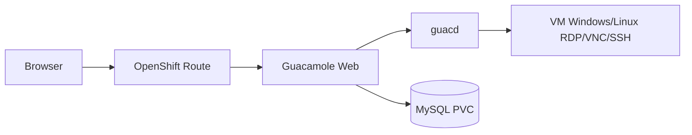

# Guacamole Operator for OpenShift

Operator Kubernetes/OpenShift para implantar **Apache Guacamole** de forma declarativa no Red Hat OpenShift. Baseado na implementação de referência [guacamole-rdp](https://github.com/raphaelmorsch/guacamole-rdp).

Para cada recurso customizado `Guacamole`, o operator provisiona automaticamente:

- **MySQL** com armazenamento persistente
- **guacd** (proxy RDP/VNC/SSH)
- **Guacamole web** com inicialização automática do schema do banco
- **Route OpenShift** para acesso via browser

A implantação é **rootless** e respeita as Security Context Constraints (SCC) do OpenShift.

## Arquitetura



## Pré-requisitos

- OpenShift 4.x com acesso de cluster-admin (para instalar o operator)
- `oc` CLI autenticado no cluster
- `make`, Go 1.21+, Docker ou Podman (para build da imagem)
- Operator Lifecycle Manager (OLM) — já presente em clusters OpenShift

## Custom Resource

```yaml
apiVersion: guacamole.guacamole.io/v1alpha1
kind: Guacamole
metadata:
  name: guacamole
  namespace: guacamole
spec:
  guacamoleImage: guacamole/guacamole:1.6.0
  guacdImage: guacamole/guacd:1.6.0
  mysqlImage: mysql:8.0
  replicas: 1
  database:
    storageSize: 5Gi
  route:
    enabled: true
    tlsTermination: edge
```

Após a reconciliação, verifique o status:

```bash
oc get guacamole guacamole -n guacamole
oc describe guacamole guacamole -n guacamole
```

O campo `status.routeURL` conterá a URL externa quando a Route estiver pronta.

---

## Passo a passo: disponibilizar o Operator no OpenShift

### Opção A — Instalação via OLM (recomendada para produção)

#### 1. Build da imagem do operator

```bash
# Clone o repositório
git clone https://github.com/raphaelmorsch/guacamole-operator.git
cd guacamole-operator

# Build local
make docker-build IMG=guacamole.io/guacamole-operator:0.0.1
```

#### 2. Push da imagem para o registry interno do OpenShift

```bash
# Login no registry interno
oc registry login

# Tag e push (substitua pelo seu namespace de destino)
export NAMESPACE=guacamole-operator-system
oc new-project $NAMESPACE 2>/dev/null || oc project $NAMESPACE

export REGISTRY=$(oc get route default-route -n openshift-image-registry \
  --template='{{ .spec.host }}' 2>/dev/null || \
  echo "image-registry.openshift-image-registry.svc:5000")

docker tag guacamole.io/guacamole-operator:0.0.1 \
  $REGISTRY/$NAMESPACE/guacamole-operator:0.0.1

docker push $REGISTRY/$NAMESPACE/guacamole-operator:0.0.1
```

#### 3. Gerar o bundle OLM

```bash
export IMG=$REGISTRY/$NAMESPACE/guacamole-operator:0.0.1

make bundle VERSION=0.0.1 IMG=$IMG
make bundle-build BUNDLE_IMG=$REGISTRY/$NAMESPACE/guacamole-operator-bundle:0.0.1
docker push $REGISTRY/$NAMESPACE/guacamole-operator-bundle:0.0.1
```

#### 4. Publicar o bundle no cluster (CatalogSource)

```bash
# Criar catalog image (opcional, para catalog index)
make catalog-build \
  CATALOG_IMG=$REGISTRY/$NAMESPACE/guacamole-operator-catalog:0.0.1 \
  BUNDLE_IMG=$REGISTRY/$NAMESPACE/guacamole-operator-bundle:0.0.1

docker push $REGISTRY/$NAMESPACE/guacamole-operator-catalog:0.0.1
```

Crie o `CatalogSource`:

```yaml
apiVersion: operators.coreos.com/v1alpha1
kind: CatalogSource
metadata:
  name: guacamole-operator-catalog
  namespace: openshift-marketplace
spec:
  sourceType: grpc
  image: <REGISTRY>/<NAMESPACE>/guacamole-operator-catalog:0.0.1
  displayName: Guacamole Operator Catalog
  publisher: Raphael Morsch
  updateStrategy:
    registryPoll:
      interval: 10m
```

```bash
oc apply -f catalogsource.yaml

# Aguarde o catalog ficar ready
oc get catalogsource guacamole-operator-catalog -n openshift-marketplace
```

#### 5. Criar OperatorGroup e Subscription

```bash
# Namespace onde o operator vai rodar
oc new-project guacamole-operator-system
```

```yaml
# operatorgroup.yaml
apiVersion: operators.coreos.com/v1
kind: OperatorGroup
metadata:
  name: guacamole-operator
  namespace: guacamole-operator-system
spec:
  targetNamespaces:
  - guacamole-operator-system
```

```yaml
# subscription.yaml
apiVersion: operators.coreos.com/v1alpha1
kind: Subscription
metadata:
  name: guacamole-operator
  namespace: guacamole-operator-system
spec:
  channel: alpha
  name: guacamole-operator
  source: guacamole-operator-catalog
  sourceNamespace: openshift-marketplace
  installPlanApproval: Automatic
```

```bash
oc apply -f operatorgroup.yaml
oc apply -f subscription.yaml

# Verificar instalação
oc get csv -n guacamole-operator-system
oc get pods -n guacamole-operator-system
```

#### 6. Criar uma instância Guacamole

```bash
oc new-project guacamole
oc apply -f config/samples/guacamole_v1alpha1_guacamole.yaml

# Acompanhar
oc get guacamole -n guacamole -w
oc get pods -n guacamole
oc get route -n guacamole
```

Acesse a URL em `status.routeURL` ou via:

```bash
oc get guacamole guacamole -n guacamole -o jsonpath='{.status.routeURL}{"\n"}'
```

---

### Opção B — Instalação direta (sem OLM, mais rápida para testes)

Ideal para desenvolvimento e validação rápida.

#### 1. Build e push da imagem

```bash
make docker-build IMG=guacamole.io/guacamole-operator:0.0.1
# Push para registry acessível pelo cluster (ajuste conforme seu ambiente)
```

#### 2. Instalar CRDs e deploy do operator

```bash
# Instalar CRD
make install

# Deploy do controller
make deploy IMG=<seu-registry>/guacamole-operator:0.0.1
```

Ou gere um manifest único:

```bash
make build-installer IMG=<seu-registry>/guacamole-operator:0.0.1
oc apply -f dist/install.yaml
```

#### 3. Criar instância Guacamole

```bash
oc new-project guacamole
oc apply -f config/samples/guacamole_v1alpha1_guacamole.yaml
oc get guacamole, pods, routes -n guacamole
```

---

### Opção C — Executar localmente (desenvolvimento)

```bash
make install   # instala CRDs no cluster
make run       # executa o controller localmente usando ~/.kube/config
```

Em outro terminal:

```bash
oc apply -f config/samples/guacamole_v1alpha1_guacamole.yaml
```

---

## Desenvolvimento

```bash
make generate   # regenera DeepCopy
make manifests  # regenera CRD e RBAC
make build      # compila bin/manager
make test       # testes unitários
```

## Desinstalação

```bash
# Remover instâncias Guacamole (cascata via owner references)
oc delete guacamole --all -n guacamole

# Via OLM
oc delete subscription guacamole-operator -n guacamole-operator-system
oc delete csv -l operators.coreos.com/guacamole-operator -n guacamole-operator-system

# Instalação direta
make undeploy
make uninstall
```

## Referências

- [guacamole-rdp](https://github.com/raphaelmorsch/guacamole-rdp) — implementação YAML de referência
- [Apache Guacamole](https://guacamole.apache.org/)
- [Operator SDK](https://sdk.operatorframework.io/)
- [OpenShift OLM](https://docs.openshift.com/container-platform/latest/operators/understanding/olm/olm-understanding-olm.html)

## Licença

Apache 2.0
