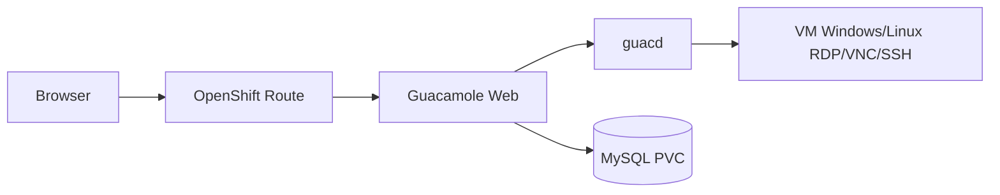

# Guacamole Operator for OpenShift

Operator Kubernetes/OpenShift para implantar **Apache Guacamole** de forma declarativa no Red Hat OpenShift. Baseado na implementação de referência [guacamole-rdp](https://github.com/raphaelmorsch/guacamole-rdp).

Para cada recurso customizado `Guacamole`, o operator provisiona automaticamente:

- **MySQL** com armazenamento persistente
- **guacd** (proxy RDP/VNC/SSH)
- **Guacamole web** com inicialização automática do schema do banco
- **Route OpenShift** para acesso via browser

A implantação é **rootless** e respeita as Security Context Constraints (SCC) do OpenShift.

## Arquitetura



---

## Pré-requisitos

| Ferramenta | Versão mínima | Observação |
|---|---|---|
| OpenShift | 4.x | Acesso `cluster-admin` para instalar via OLM |
| `oc` | — | Autenticado no cluster |
| `go` | 1.21+ | Compilar o operator |
| `make` | — | Targets do projeto |
| `podman` | — | Build e push de imagens (use Podman de ponta a ponta) |
| `operator-sdk` | 1.37+ | Gerar bundle OLM |
| OLM | — | Já presente em clusters OpenShift |

> **Apple Silicon (M1/M2/M3):** clusters OpenShift usam `amd64`. Sempre build de imagens com `--platform linux/amd64`.

---

## Tutorial completo — do zero ao Operator Hub

Este tutorial reflete o fluxo **testado e validado** em um Mac M1 com Podman e OpenShift 4.x. A versão estável atual é **0.0.4**.

### Visão geral das fases

| Fase | O que faz | Resultado esperado |
|---|---|---|
| 1 | Compilar e buildar imagem do operator | Imagem `amd64` local |
| 2 | Push para registry do OpenShift + bundle/catalog | 3 imagens no cluster |
| 3 | Registrar catálogo OLM e instalar | CSV `Succeeded` |
| 4 | Criar instância Guacamole | Stack rodando |

---

### Fase 0 — Variáveis de ambiente

Defina uma vez e reutilize em todos os passos:

```bash
export VERSION=0.0.4
export NAMESPACE=guacamole-operator-system
```

Faça login no cluster:

```bash
oc login <API_URL> -u <USER> -p <PASSWORD>
oc whoami   # deve retornar seu usuário
```

---

### Fase 1 — Build local

```bash
git clone https://github.com/raphaelmorsch/guacamole-operator.git
cd guacamole-operator

# Compilar o binário (validação)
make build
ls -lh bin/manager
```

Build da **imagem do operator** para `amd64`:

```bash
podman build --platform linux/amd64 \
  -t guacamole.io/guacamole-operator:${VERSION} .

# Confirmar arquitetura
podman inspect guacamole.io/guacamole-operator:${VERSION} \
  --format 'Arch: {{.Architecture}}'
# Esperado: amd64
```

---

### Fase 2 — Push para o registry do OpenShift

#### 2a. Habilitar route do registry (se necessário)

```bash
oc get route default-route -n openshift-image-registry
```

Se não existir:

```bash
oc patch configs.imageregistry.operator.openshift.io/cluster \
  --patch '{"spec":{"defaultRoute":true}}' --type=merge
```

Aguarde ~1 minuto e confirme:

```bash
export REGISTRY=$(oc get route default-route -n openshift-image-registry \
  --template='{{ .spec.host }}')
echo $REGISTRY
```

#### 2b. Criar namespace e fazer login no registry

```bash
oc new-project ${NAMESPACE}

podman login --tls-verify=false \
  -u $(oc whoami) \
  -p $(oc whoami -t) \
  ${REGISTRY}
```

#### 2c. Tag e push do operator

```bash
podman tag guacamole.io/guacamole-operator:${VERSION} \
  ${REGISTRY}/${NAMESPACE}/guacamole-operator:${VERSION}

podman push ${REGISTRY}/${NAMESPACE}/guacamole-operator:${VERSION}
```

> **Importante:** crie o namespace **antes** do push. Push sem namespace existente retorna `denied`.

#### 2d. Gerar bundle OLM com a imagem correta do registry

> **Crítico:** passe `IMG` apontando para o registry do OpenShift. Se usar `guacamole.io/...`, o CSV embutirá uma imagem inexistente e o deployment ficará em `ImagePullBackOff`.

```bash
make bundle VERSION=${VERSION} DEFAULT_CHANNEL=alpha \
  IMG=${REGISTRY}/${NAMESPACE}/guacamole-operator:${VERSION}

make bundle-build \
  BUNDLE_IMG=${REGISTRY}/${NAMESPACE}/guacamole-operator-bundle:${VERSION} \
  CONTAINER_TOOL=podman

podman push ${REGISTRY}/${NAMESPACE}/guacamole-operator-bundle:${VERSION}
```

#### 2e. Gerar e push da catalog image (crítico no M1)

O `bin/opm index add` sem `--generate` produz imagem `arm64` no Mac. Gere o Dockerfile e build com plataforma explícita:

```bash
bin/opm index add \
  --pull-tool podman \
  --mode semver \
  --generate \
  -d index.Dockerfile \
  --bundles ${REGISTRY}/${NAMESPACE}/guacamole-operator-bundle:${VERSION}

podman build --platform linux/amd64 \
  -f index.Dockerfile \
  -t ${REGISTRY}/${NAMESPACE}/guacamole-operator-catalog:${VERSION} .

podman inspect ${REGISTRY}/${NAMESPACE}/guacamole-operator-catalog:${VERSION} \
  --format 'Arch: {{.Architecture}}'
# Esperado: amd64

podman push ${REGISTRY}/${NAMESPACE}/guacamole-operator-catalog:${VERSION}
```

Confirmar no cluster:

```bash
oc get imagestream -n ${NAMESPACE}
```

---

### Fase 3 — Publicar no Operator Hub

#### 3a. Permitir pull do catálogo

O namespace `openshift-marketplace` precisa puxar imagens do seu namespace:

```bash
oc adm policy add-role-to-group system:image-puller \
  system:serviceaccounts:openshift-marketplace \
  -n ${NAMESPACE}
```

#### 3b. Aplicar CatalogSource

Atualize a tag da imagem em `config/olm/catalogsource.yaml` para a versão desejada, depois aplique:

```bash
oc apply -f config/olm/catalogsource.yaml
```

O arquivo usa a URL **interna** do registry (funciona em qualquer OpenShift):

```yaml
image: image-registry.openshift-image-registry.svc:5000/guacamole-operator-system/guacamole-operator-catalog:0.0.4
```

Aguarde o pod do catálogo ficar `Running`:

```bash
oc get pods -n openshift-marketplace | grep guacamole
```

Esperado: `1/1 Running` (não `CrashLoopBackOff` nem `ImagePullBackOff`).

#### 3c. Instalar o operator via Subscription

O `OperatorGroup` usa `spec: {}` para instalação **AllNamespaces** (o operator observa CRs em todos os namespaces):

```bash
oc apply -f config/olm/operatorgroup.yaml
oc apply -f config/olm/subscription.yaml
```

Verificar:

```bash
oc get packagemanifest | grep guacamole
oc get csv -n ${NAMESPACE}
```

Aguarde o controller ficar pronto:

```bash
oc get pods -n ${NAMESPACE} -w
```

Esperado: `2/2 Running`.

```bash
oc get csv guacamole-operator.v${VERSION} -n ${NAMESPACE}
```

Esperado: `PHASE: Succeeded`.

A partir da versão **0.0.3+**, o CSV já embute as imagens corretas:

- `quay.io/brancz/kube-rbac-proxy:v0.18.2`
- Imagem do operator no registry do OpenShift

---

### Fase 4 — Verificar no Web Console

1. Acesse **Operators → Operator Hub**
2. Busque **"Guacamole Operator"**
3. Deve aparecer com badge **Installed** (já instalado via Subscription)

---

### Fase 5 — Criar uma instância Guacamole

O operator pode criar instâncias em **qualquer namespace** (OperatorGroup global):

```bash
oc new-project guacamole
oc apply -f config/samples/guacamole_v1alpha1_guacamole.yaml
```

Acompanhar:

```bash
oc get guacamole -n guacamole
oc get pods -n guacamole
oc get route -n guacamole
```

Obter a URL externa:

```bash
oc get guacamole guacamole -n guacamole \
  -o jsonpath='{.status.routeURL}{"\n"}'
```

Credenciais padrão do Guacamole após primeiro acesso: `guacadmin` / `guacadmin` (altere imediatamente).

---

## Custom Resource — referência

```yaml
apiVersion: guacamole.guacamole.io/v1alpha1
kind: Guacamole
metadata:
  name: guacamole
  namespace: guacamole
spec:
  guacamoleImage: guacamole/guacamole:1.6.0
  guacdImage: guacamole/guacd:1.6.0
  mysqlImage: mysql:8.0
  replicas: 1
  database:
    storageSize: 5Gi
  route:
    enabled: true
    tlsTermination: edge
    path: /guacamole
  autoscaling:
    enabled: true
    minReplicas: 1
    maxReplicas: 5
    targetMemoryUtilizationPercentage: 80
    # targetCPUUtilizationPercentage: 80  # opcional
  guacdAutoscaling:
    enabled: true
    minReplicas: 1
    maxReplicas: 5
    targetMemoryUtilizationPercentage: 80
```

> **HPA por memória:** requer `requests.memory` definido nos resources do componente (o operator já aplica defaults). Com autoscaling habilitado, o operator não sobrescreve as réplicas gerenciadas pelo HPA.

> **Route path:** o Guacamole serve a UI em `/guacamole`. O operator define `spec.route.path` com esse valor por padrão; o `status.routeURL` já inclui o path.

### GuacamoleConnection

Cria conexões declarativas no banco MySQL da instância Guacamole, conforme o [schema JDBC](https://guacamole.apache.org/doc/gug/jdbc-auth-schema.html) e a [administração de connections](https://guacamole.apache.org/doc/gug/administration.html#connections-and-connection-groups).

```yaml
apiVersion: guacamole.guacamole.io/v1alpha1
kind: GuacamoleConnection
metadata:
  name: windows-jumphost
  namespace: guacamole
spec:
  guacamoleRef:
    name: guacamole
  displayName: Windows Jump Host
  protocol: rdp
  rdp:
    hostname: 10.0.0.4
    port: 3389
    username: Administrator
    passwordSecretRef:
      name: windows-jumphost-credentials
      key: password
    security: nla
    ignoreCert: true
    width: 1920
    height: 1080
    dpi: 96
  permissions:
    - entityName: guacadmin
      entityType: USER
      permission: READ
```

Campos principais:

| Campo | Descrição |
|---|---|
| `guacamoleRef` | Instância `Guacamole` alvo |
| `displayName` | Nome exibido na UI (default: `metadata.name`) |
| `protocol` | `rdp`, `vnc`, `ssh`, `telnet`, `kubernetes` |
| `parentGroup` | Nome do connection group pai (opcional) |
| `rdp` / `vnc` / `ssh` | Parâmetros do protocolo → `guacamole_connection_parameter` |
| `additionalParameters` | Parâmetros extras arbitrários |
| `permissions` | Permissões `READ`, `UPDATE`, `DELETE`, `ADMINISTER` |

O `status.connectionID` guarda o ID no MySQL para updates idempotentes. Senhas devem usar `passwordSecretRef`.

---

## Publicar uma nova versão

Para publicar uma correção (ex.: `0.0.5`):

```bash
export VERSION=0.0.5

# 1. Rebuild e push (mesmo fluxo da Fase 1 + 2)
podman build --platform linux/amd64 -t guacamole.io/guacamole-operator:${VERSION} .
podman tag guacamole.io/guacamole-operator:${VERSION} \
  ${REGISTRY}/${NAMESPACE}/guacamole-operator:${VERSION}
podman push ${REGISTRY}/${NAMESPACE}/guacamole-operator:${VERSION}

make bundle VERSION=${VERSION} DEFAULT_CHANNEL=alpha \
  IMG=${REGISTRY}/${NAMESPACE}/guacamole-operator:${VERSION}
make bundle-build BUNDLE_IMG=${REGISTRY}/${NAMESPACE}/guacamole-operator-bundle:${VERSION} CONTAINER_TOOL=podman
podman push ${REGISTRY}/${NAMESPACE}/guacamole-operator-bundle:${VERSION}

bin/opm index add --pull-tool podman --mode semver --generate -d index.Dockerfile \
  --bundles ${REGISTRY}/${NAMESPACE}/guacamole-operator-bundle:${VERSION}
podman build --platform linux/amd64 -f index.Dockerfile \
  -t ${REGISTRY}/${NAMESPACE}/guacamole-operator-catalog:${VERSION} .
podman push ${REGISTRY}/${NAMESPACE}/guacamole-operator-catalog:${VERSION}

# 2. Atualizar tag em config/olm/catalogsource.yaml e aplicar
oc apply -f config/olm/catalogsource.yaml
oc delete pod -n openshift-marketplace -l olm.catalogSource=guacamole-operator-catalog

# 3. Aguardar upgrade automático ou recriar subscription se ficar presa (ver Troubleshooting)
oc get csv -n ${NAMESPACE}
```

---

## Troubleshooting

### HTTP 404 ao acessar a Route

**Causa:** o Guacamole expõe a UI em `/guacamole`, não na raiz `/`.

**Solução:** versões atuais do operator definem `spec.route.path: /guacamole` por padrão. Acesse `https://<host>/guacamole` ou confira `status.routeURL`.

---

### `Table 'guacamole_db.guacamole_user' doesn't exist`

**Causa:** o init container `apply-initdb` rodou antes do MySQL estar pronto. O script antigo não aguardava a conexão e imprimia "complete" mesmo com falha.

**Correção:** versão **0.0.4+** aguarda o MySQL (retry até 5 min) e falha explicitamente se o schema não for aplicado.

**Recuperação manual** (instância já criada com schema vazio):

```bash
# Gerar SQL a partir do pod Guacamole
oc exec -n <namespace> deploy/<guacamole-deploy> -- \
  /opt/guacamole/bin/initdb.sh --mysql > /tmp/initdb.sql

# Aplicar no MySQL
oc cp /tmp/initdb.sql <namespace>/<mysql-pod>:/tmp/initdb.sql
oc exec -n <namespace> <mysql-pod> -- sh -c \
  'MYSQL_PWD="$MYSQL_PASSWORD" mysql -u "$MYSQL_USER" "$MYSQL_DATABASE" < /tmp/initdb.sql'
```

Ou delete o deployment Guacamole e aguarde o operator recriar (com operator 0.0.4+).

---

### Deployment do operator em `ImagePullBackOff`

**Causa comum:** bundle gerado com `IMG=guacamole.io/...` (host inexistente) ou `kube-rbac-proxy` antigo.

**Solução:** regenere o bundle com `IMG=${REGISTRY}/${NAMESPACE}/guacamole-operator:${VERSION}` e publique nova versão.

**Workaround** (versões 0.0.1 / 0.0.2):

```bash
oc set image deployment/guacamole-operator-controller-manager \
  manager=${REGISTRY}/${NAMESPACE}/guacamole-operator:${VERSION} \
  kube-rbac-proxy=quay.io/brancz/kube-rbac-proxy:v0.18.2 \
  -n ${NAMESPACE}
```

---

### Catalog pod `Exec format error` ou `CrashLoopBackOff`

**Causa:** catalog image buildada em `arm64` no Mac.

**Solução:** use `bin/opm index add --generate` + `podman build --platform linux/amd64`.

---

### Catalog pod `ImagePullBackOff`

**Causa:** `openshift-marketplace` sem permissão para puxar imagens do seu namespace.

**Solução:**

```bash
oc adm policy add-role-to-group system:image-puller \
  system:serviceaccounts:openshift-marketplace \
  -n ${NAMESPACE}
```

Use a URL **interna** do registry no `CatalogSource` (`image-registry.openshift-image-registry.svc:5000/...`).

---

### `This operator requires an OperatorGroup` ou erro de `targetNamespaces`

**Causa:** `OperatorGroup` com `targetNamespaces` incorreto para instalação global.

**Solução:** use `spec: {}` em `config/olm/operatorgroup.yaml` (AllNamespaces).

---

### Subscription presa em versão antiga (`UpgradePending`)

**Causa:** install plan obsoleto após atualizar o catálogo.

**Solução:**

```bash
oc delete subscription guacamole-operator -n ${NAMESPACE}
oc delete csv guacamole-operator.v<versao-antiga> -n ${NAMESPACE}  # se existir
oc apply -f config/olm/subscription.yaml
```

Confirme que o `packagemanifest` expõe a versão nova:

```bash
oc get packagemanifest guacamole-operator -n openshift-marketplace \
  -o jsonpath='{.status.channels[0].currentCSV}{"\n"}'
```

---

### Thumbnail ausente no Operator Hub

O ícone vem do campo `spec.icon` no CSV (`config/manifests/guacamole-icon.png`). Após alterar, regenere bundle + catalog, faça push e reinicie o pod do catálogo (ver seção **Ícone no Software Catalog**).

---

## O que NÃO fazer (lições aprendidas)

| Abordagem | Por que falha |
|---|---|
| `make docker-buildx` no M1 | Tenta 4 arquiteturas; `go mod download` falha no buildx |
| `guacamole.io/...` como registry | Host não existe — é só tag local |
| `make bundle` sem `IMG=${REGISTRY}/...` | CSV referencia imagem inexistente → `ImagePullBackOff` |
| `localhost/...` sem porta | Podman interpreta como registry HTTPS na porta 443 |
| `bin/opm index add` sem `--generate` no M1 | Catalog image sai `arm64` → `Exec format error` no cluster |
| `DOCKER_DEFAULT_PLATFORM` com `opm` | Variável ignorada pelo `opm` no `podman build` interno |
| Push antes de `oc new-project` | Registry retorna `denied` |
| CatalogSource com URL externa sem RBAC | `authentication required` no `openshift-marketplace` |
| Misturar Docker e Podman | Uma ferramenta não vê imagens da outra |
| Confiar no log "schema initialization complete" (pré-0.0.4) | Init container podia falhar silenciosamente |

---

## Alternativa — instalação direta (sem Operator Hub)

Para testes rápidos, sem OLM:

```bash
make install
make deploy IMG=${REGISTRY}/${NAMESPACE}/guacamole-operator:${VERSION}

oc new-project guacamole
oc apply -f config/samples/guacamole_v1alpha1_guacamole.yaml
```

---

## Desenvolvimento local

```bash
make generate   # regenera DeepCopy
make manifests  # regenera CRD e RBAC
make build      # compila bin/manager (arm64 no M1 — só para uso local)
make test       # testes unitários
```

Rodar o controller localmente:

```bash
make install
make run
```

---

## Desinstalação

```bash
# Remover instâncias Guacamole (em todos os namespaces onde foram criadas)
oc delete guacamole --all -A

# Remover operator via OLM
oc delete -f config/olm/subscription.yaml
oc delete csv guacamole-operator.v${VERSION} -n ${NAMESPACE}
oc delete -f config/olm/catalogsource.yaml
oc delete -f config/olm/operatorgroup.yaml
```

---

## Ícone no Software Catalog

O thumbnail do Operator Hub vem do campo `spec.icon` no CSV. O ícone fonte fica em `config/manifests/guacamole-icon.png`.

Após alterar o ícone, regenere o bundle e a catalog image, faça push e reinicie o pod do catálogo:

```bash
make bundle VERSION=${VERSION} DEFAULT_CHANNEL=alpha IMG=${REGISTRY}/${NAMESPACE}/guacamole-operator:${VERSION}
make bundle-build BUNDLE_IMG=${REGISTRY}/${NAMESPACE}/guacamole-operator-bundle:${VERSION} CONTAINER_TOOL=podman
podman push ${REGISTRY}/${NAMESPACE}/guacamole-operator-bundle:${VERSION}

bin/opm index add --pull-tool podman --mode semver --generate -d index.Dockerfile \
  --bundles ${REGISTRY}/${NAMESPACE}/guacamole-operator-bundle:${VERSION}
podman build --platform linux/amd64 -f index.Dockerfile \
  -t ${REGISTRY}/${NAMESPACE}/guacamole-operator-catalog:${VERSION} .
podman push ${REGISTRY}/${NAMESPACE}/guacamole-operator-catalog:${VERSION}

oc delete pod -n openshift-marketplace -l olm.catalogSource=guacamole-operator-catalog
```

---

## Referências

- [guacamole-rdp](https://github.com/raphaelmorsch/guacamole-rdp) — implementação YAML de referência
- [Apache Guacamole](https://guacamole.apache.org/)
- [Operator SDK](https://sdk.operatorframework.io/)
- [OpenShift OLM](https://docs.openshift.com/container-platform/latest/operators/understanding/olm/olm-understanding-olm.html)

## Licença

Apache 2.0
