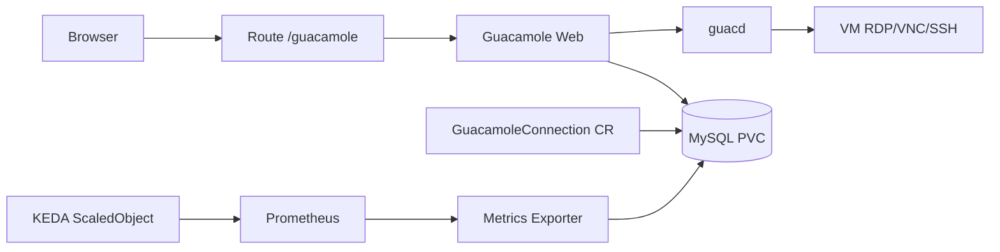

# Guacamole Operator for OpenShift

Operator Kubernetes/OpenShift para implantar **Apache Guacamole** de forma declarativa no Red Hat OpenShift. Baseado na implementação de referência [guacamole-rdp](https://github.com/raphaelmorsch/guacamole-rdp).

**Versão OLM (CSV) atual:** `0.0.16`

**Imagens publicadas (Quay.io):** [`quay.io/ramoreir/guacamole-operator`](https://quay.io/ramoreir/guacamole-operator) · [`guacamole-operator-catalog`](https://quay.io/ramoreir/guacamole-operator-catalog) · [`guacamole-operator-bundle`](https://quay.io/ramoreir/guacamole-operator-bundle)

> Guia rápido pelo **OpenShift Web Console:** [Instalar via Quay](#instalar-via-quayio) · [Instalar o Operator](#instalar-o-guacamole-operator-pelo-web-console) · [Configurar Guacamole](#configurar-o-crd-guacamole-pelo-web-console) · [Configurar DesktopPool](#configurar-o-crd-desktoppool-pelo-web-console) · [Release Notes](#release-notes)

## Custom Resources

| CRD | Descrição |
|---|---|
| `Guacamole` | Provisiona a stack completa (MySQL, guacd, web, Route, HPA, métricas Prometheus, OpenID opcional) |
| `GuacamoleConnection` | Cria conexões RDP/VNC/SSH no banco MySQL da instância |
| `DesktopPool` | Pool de VMs Windows clonadas de um DataSource golden (OpenShift Virtualization) |
| `DesktopSession` | Reserva exclusiva de um desktop do pool + `GuacamoleConnection` sob demanda |
| `DesktopPortal` | Plugin no OpenShift Console + User Portal self-service (Keycloak) para alocar DesktopSessions |

Para cada recurso `Guacamole`, o operator provisiona automaticamente:

- **MySQL** com armazenamento persistente e init do schema
- **guacd** (proxy RDP/VNC/SSH) com HPA opcional
- **Guacamole web** com HPA opcional
- **Route OpenShift** com path `/guacamole`
- **Exporter Prometheus** opcional — ativado por `exposeMetrics` em cada `GuacamoleConnection`

Para cada recurso `GuacamoleConnection`, o operator sincroniza:

- Registro em `guacamole_connection` e parâmetros do protocolo
- Permissões de acesso (`READ`, `UPDATE`, `DELETE`, `ADMINISTER`)

A implantação é **rootless** e respeita as Security Context Constraints (SCC) do OpenShift.

## Arquitetura


```mermaid
flowchart LR
    User[Browser] --> Route["Route /guacamole"]
    Route --> Guac[Guacamole Web]
    Guac --> Guacd[guacd]
    Guac --> MySQL[(MySQL PVC)]
    Guacd --> Target[VM RDP/VNC/SSH]
    ConnCR[GuacamoleConnection CR] --> MySQL
    Metrics[Metrics Exporter] --> MySQL
    Prometheus[Prometheus] --> Metrics
    KEDA[KEDA ScaledObject] --> Prometheus
```

---

## Métricas Prometheus (KEDA)

O Pod de métricas (`{guacamole-name}-metrics`) é criado **automaticamente** quando pelo menos um `GuacamoleConnection` tem `spec.exposeMetrics: true`. Cada conexão marcada adiciona uma query ao exporter compartilhado da instância.

### Habilitar no GuacamoleConnection

```yaml
apiVersion: guacamole.guacamole.io/v1alpha1
kind: GuacamoleConnection
metadata:
  name: windows-jumphost
spec:
  guacamoleRef:
    name: guacamole
  displayName: Windows Jump Host
  exposeMetrics: true   # checkbox — inclui esta conexão no Pod de metrics
  protocol: rdp
  rdp:
    hostname: 10.0.0.4
```

Configuração opcional da imagem/porta do exporter no CR `Guacamole`:

```yaml
spec:
  metricsExporter:
    image: default-route-openshift-image-registry.apps.<cluster>/guacamole/guacamole-metrics-exporter:0.0.7
    port: 9110
    scrapeIntervalSeconds: 15
```

### Query por conexão

Para cada conexão monitorada, o exporter executa:

```sql
SELECT COUNT(*)
FROM guacamole_connection_history
WHERE end_date IS NULL AND connection_id = ?
```

Enquanto `connection_id` ainda não existir no status, usa `connection_name` como fallback.

### Métricas expostas

| Métrica | Labels | Uso |
|---|---|---|
| `guacamole_connection_active_sessions` | `connection_id`, `connection_name`, `remote_host` | Sessões ativas por conexão (KEDA) |
| `guacamole_metrics_exporter_last_scrape_success` | — | Health do scrape MySQL |

O label `remote_host` vem do hostname do protocolo (`spec.rdp.hostname`, etc.) — identifica a VM destino.

### Build da imagem do exporter

```bash
podman build --platform linux/amd64 -f Dockerfile.metrics-exporter \
  -t default-route-openshift-image-registry.apps.<cluster>/guacamole/guacamole-metrics-exporter:0.0.7 .

podman push --tls-verify=false \
  default-route-openshift-image-registry.apps.<cluster>/guacamole/guacamole-metrics-exporter:0.0.7
```

### Exemplo KEDA

```yaml
apiVersion: keda.sh/v1alpha1
kind: ScaledObject
metadata:
  name: vm-pool-scaler
spec:
  scaleTargetRef:
    name: windows-vm-pool
  minReplicaCount: 1
  maxReplicaCount: 10
  triggers:
    - type: prometheus
      metadata:
        serverAddress: http://prometheus-operated.openshift-monitoring.svc:9090
        query: |
          sum(guacamole_connection_active_sessions{remote_host="10.0.0.4"})
        threshold: "5"
```

---

## Release Notes

### 0.0.16

- **DesktopPortal**: plugin dinâmico no OpenShift Console para listar usuários Keycloak e alocar/liberar `DesktopSession`s em lote
- **User Portal** self-service (PatternFly + Route) com login Keycloak OIDC (PKCE)
- Seleção de **Desktop Pool** no Console plugin e no User Portal (status, sessions e allocate no pool escolhido)
- Suporte a **múltiplos DesktopPortal** (identidade ConsolePlugin/path únicos; override via `spec.pluginName` / `spec.consolePath`)
- OpenID Connect no CR `Guacamole` (SSO Keycloak na UI do Guacamole)
- Portal-api com TLS (serving cert), TokenReview/SAR para admins do Console
- Power management do pool (idle stop / wake) configurável pelo portal
- Session lifecycle: logoff após idle de disconnect + TTL máximo opcional
- Fila de broker com prioridade para `DesktopSession`
- Batch create/delete de sessions no portal

### 0.0.15

- Regeneração do bundle OLM com CRDs DesktopPool / DesktopSession / DesktopPortal
- Ajustes de publicação no Operator Hub / Software Catalog

### 0.0.12 – 0.0.14

- CRDs **DesktopPool** e **DesktopSession**
- Clone de VMs a partir de CDI `DataSource` (OpenShift Virtualization)
- Credenciais RDP gerenciadas (`password` ou `passwordSecretRef`)
- RBAC automático para clone cross-namespace (golden image)
- Alocação/liberação de desktop + `GuacamoleConnection` sob demanda
- Recycle policy `Delete` / `Retain`

### 0.0.7 – 0.0.11

- **0.0.7**: métricas Prometheus por conexão (`exposeMetrics` no `GuacamoleConnection`) + exporter compartilhado
- Evolução do exporter e relatedImages no CSV

### 0.0.6

- CRD **GuacamoleConnection** — conexões RDP/VNC/SSH declarativas sincronizadas no MySQL
- Permissões (`READ`, `UPDATE`, `DELETE`, `ADMINISTER`)

### 0.0.5

- HPA para **guacd**
- Route com path padrão `/guacamole`

### 0.0.4

- HPA para a aplicação web Guacamole
- Init do schema MySQL confiável (retry + falha explícita)

### 0.0.3

- Imagens corretas no CSV (`kube-rbac-proxy` v0.18.2, registry OpenShift)
- Correções de ImagePullBackOff em clusters reais

### 0.0.1 – 0.0.2

- Primeira publicação OLM / CatalogSource
- CRD `Guacamole` (MySQL + guacd + web + Route)

---

## Pré-requisitos

### Para instalar e operar pelo Web Console

| Requisito | Observação |
|---|---|
| OpenShift 4.x | OLM já incluso |
| Permissão | `cluster-admin` (ou equivalente) para instalar Operators |
| CatalogSource | Catálogo no cluster — [via Quay.io](#instalar-via-quayio) (recomendado) ou [build local](#tutorial-completo--do-zero-ao-operator-hub) |
| OpenShift Virtualization + CDI | Necessários para **DesktopPool** (clone de VMs) |
| DataSource golden | Imagem Windows pronta (ex.: `win2k19-guacamole-desktop`) |

### Para build / publicação (desenvolvedores)

| Ferramenta | Versão mínima | Observação |
|---|---|---|
| `oc` | — | Autenticado no cluster |
| `go` | 1.21+ | Compilar o operator |
| `make` | — | Targets do projeto |
| `podman` | — | Build e push (`--platform linux/amd64` no Apple Silicon) |
| `operator-sdk` | 1.37+ | Gerar bundle OLM |

---

## Instalar via Quay.io

As imagens OLM do Guacamole Operator estão publicadas em **quay.io/ramoreir**:

| Imagem | Uso |
|---|---|
| `quay.io/ramoreir/guacamole-operator-catalog:0.0.16` | CatalogSource (Operator Hub) |
| `quay.io/ramoreir/guacamole-operator-bundle:0.0.16` | Bundle OLM (referenciado pelo catálogo) |
| `quay.io/ramoreir/guacamole-operator:0.0.16` | Deployment do controller |

### CLI (recomendado)

```bash
oc login <API_URL> -u <USER> -p <PASSWORD>

# 1. Registrar o catálogo no Operator Hub
oc apply -f config/olm/catalogsource.yaml

# 2. Aguardar o pod do catálogo
oc get pods -n openshift-marketplace | grep guacamole
# Esperado: guacamole-operator-catalog-*   1/1   Running

# 3. Instalar o operator (AllNamespaces)
oc new-project guacamole-operator --dry-run=client -o yaml | oc apply -f -
oc apply -f config/olm/operatorgroup.yaml
oc apply -f config/olm/subscription.yaml

# 4. Confirmar instalação
oc get csv -n guacamole-operator
oc get pods -n guacamole-operator
```

O `config/olm/catalogsource.yaml` aponta para:

```yaml
image: quay.io/ramoreir/guacamole-operator-catalog:0.0.16
```

> **Repositório privado no Quay:** crie um `imagePullSecret` no namespace `openshift-marketplace` e associe-o ao `ServiceAccount` `default` (ou ao SA usado pelo catalog operator). Repositórios públicos não exigem esse passo.

### Web Console

1. Aplique o CatalogSource pela CLI (passo acima) ou em **Administrator → CustomResourceDefinitions → CatalogSource → Create** com o YAML de `config/olm/catalogsource.yaml`.
2. Aguarde o catálogo ficar saudável em **Administrator → Administration → Cluster Settings → OperatorHub** (ou verifique o pod em `openshift-marketplace`).
3. Siga [Instalar o Guacamole Operator pelo Web Console](#instalar-o-guacamole-operator-pelo-web-console).

### Imagens auxiliares (DesktopPortal / métricas)

O CSV referencia também imagens no mesmo registry Quay (tag `0.0.16`):

- `quay.io/ramoreir/guacamole-metrics-exporter`
- `quay.io/ramoreir/guacamole-desktop-portal-plugin`
- `quay.io/ramoreir/guacamole-desktop-portal-api`
- `quay.io/ramoreir/guacamole-desktop-user-portal`

Publique-as com `make docker-buildx` / `make desktop-portal-images` (ver Makefile) e `podman push` para o Quay antes de usar **DesktopPortal** ou `exposeMetrics` sem `spec.metricsExporter.image` explícito.

Para instalação com registry **interno do OpenShift** (build local), use `config/olm/catalogsource-openshift.yaml` e o [tutorial CLI](#tutorial-completo--do-zero-ao-operator-hub).

---

## Instalar o Guacamole Operator pelo Web Console

Pré-condição: o **CatalogSource** do operator já está disponível no cluster (`openshift-marketplace`). A forma mais simples é [Instalar via Quay.io](#instalar-via-quayio). Para build local no registry do cluster, siga o [tutorial CLI](#tutorial-completo--do-zero-ao-operator-hub).

1. No OpenShift Web Console, abra o seletor de perspectiva e escolha **Administrator**.
2. Vá em **Operators → OperatorHub**.
3. No campo de busca, digite **Guacamole**.
4. Selecione **Guacamole Operator** → **Install**.
5. Na tela de instalação:
   - **Update channel:** `alpha` (ou o channel publicado no seu catálogo)
   - **Installation mode:** **All namespaces on the cluster** (recomendado — o operator observa CRs em qualquer project)
   - **Installed Namespace:** escolha ou crie `guacamole-operator` (ou o namespace do seu OperatorGroup)
   - **Update approval:** Automatic (ou Manual, conforme a política do cluster)
6. Clique em **Install** e aguarde o status **Succeeded** em **Operators → Installed Operators**.
7. Confirme a coluna **Status** = **Succeeded** para o CSV (ex.: `guacamole-operator.v0.0.16`).

Após instalado, os CRDs `Guacamole`, `GuacamoleConnection`, `DesktopPool`, `DesktopSession` e `DesktopPortal` aparecem em **Installed Operators → Guacamole Operator → Details / All instances**, e também em **Home → Search** (buscar pelo kind).

---

## Configurar o CRD Guacamole pelo Web Console

O CR `Guacamole` sobe MySQL, guacd, a aplicação web e a Route.

### 1. Criar o Project

1. **Home → Projects → Create Project**
2. Nome sugerido: `guacamole`
3. **Create**

### 2. Criar a instância Guacamole

1. **Operators → Installed Operators → Guacamole Operator**
2. Selecione o Project `guacamole` (dropdown no topo)
3. Aba **Guacamole** → **Create Guacamole**
4. Prefira a view **YAML** (mais completa que o form) e use um manifesto equivalente ao sample:

```yaml
apiVersion: guacamole.guacamole.io/v1alpha1
kind: Guacamole
metadata:
  name: guacamole
  namespace: guacamole
spec:
  guacamoleImage: guacamole/guacamole:1.6.0
  guacdImage: guacamole/guacd:1.6.0
  mysqlImage: mysql:8.0
  replicas: 1
  guacdReplicas: 1
  logLevel: info
  database:
    user: guacamole_user
    password: guacamole_pass
    rootPassword: rootpass123
    name: guacamole_db
    storageSize: 5Gi
  route:
    enabled: true
    tlsTermination: edge
    path: /guacamole
  autoscaling:
    enabled: true
    minReplicas: 1
    maxReplicas: 5
    targetMemoryUtilizationPercentage: 80
  guacdAutoscaling:
    enabled: true
    minReplicas: 1
    maxReplicas: 5
    targetMemoryUtilizationPercentage: 80
  # Opcional — SSO Keycloak na UI do Guacamole
  # openID:
  #   enabled: true
  #   issuer: https://keycloak.apps.example.com/realms/guacamole
  #   clientID: guacamole
  #   redirectURI: https://guacamole-<ns>.apps.example.com/guacamole
  #   usernameClaimType: preferred_username
```

5. **Create**
6. Na lista, acompanhe a coluna **Phase** até **Running** (ou `Ready`, conforme a versão do CRD).
7. Abra o recurso → aba **YAML** / **Details** e copie `status.routeURL`.
8. No browser, acesse a Route. Login inicial do Guacamole: `guacadmin` / `guacadmin` (altere imediatamente).

### Campos principais

| Campo | Função |
|---|---|
| `spec.database.*` | Credenciais e tamanho do PVC MySQL |
| `spec.route` | Expõe a UI (`path` padrão `/guacamole`, TLS edge) |
| `spec.replicas` / `guacdReplicas` | Réplicas fixas quando HPA está desligado |
| `spec.autoscaling` / `guacdAutoscaling` | HPA por uso de memória |
| `spec.openID` | SSO OIDC (Keycloak) na UI do Guacamole |
| `spec.metricsExporter` | Exporter Prometheus (ativado quando alguma Connection tem `exposeMetrics`) |

Sample completo: [`config/samples/guacamole_v1alpha1_guacamole.yaml`](config/samples/guacamole_v1alpha1_guacamole.yaml).

### (Opcional) GuacamoleConnection pelo Console

1. No mesmo Operator, aba **GuacamoleConnection** → **Create GuacamoleConnection**
2. Crie antes um Secret com a senha do host RDP (**Workloads → Secrets**).
3. No YAML, referencie `spec.guacamoleRef.name: guacamole` e `spec.rdp.passwordSecretRef`.
4. Com `exposeMetrics: true`, o Pod de métricas da instância Guacamole passa a publicar sessões ativas dessa conexão.

---

## Configurar o CRD DesktopPool pelo Web Console

O `DesktopPool` clona VMs Windows a partir de um **DataSource** golden (CDI) e as expõe via Service RDP para o Guacamole.

### Pré-requisitos no cluster

- OpenShift Virtualization (KubeVirt) e CDI instalados
- Um `DataSource` golden acessível (ex.: `win2k19-guacamole-desktop` no Project `win2k19-golden`)
- Uma instância `Guacamole` já **Running** (namespace pode ser outro, ex.: `guacamole`)
- StorageClass adequada para disco das VMs

### 1. Criar o Project do pool

1. **Home → Projects → Create Project**
2. Nome sugerido: `guacamole-desktops`

### 2. Criar o DesktopPool

1. **Operators → Installed Operators → Guacamole Operator**
2. Project: `guacamole-desktops`
3. Aba **DesktopPool** → **Create DesktopPool**
4. Use a view **YAML**:

```yaml
apiVersion: guacamole.guacamole.io/v1alpha1
kind: DesktopPool
metadata:
  name: windows-desktop
  namespace: guacamole-desktops
spec:
  replicas: 2
  source:
    dataSource:
      name: win2k19-guacamole-desktop
      namespace: win2k19-golden
  virtualMachine:
    storageClassName: ocs-external-storagecluster-ceph-rbd-immediate   # ajuste ao cluster
    diskSize: 60Gi
    cpu: 2
    memory: 4Gi
  network:
    rdpPort: 3389
  guacamole:
    instanceRef:
      name: guacamole
      namespace: guacamole
    username: Administrator
    password: "ChangeMe!"          # ou passwordSecretRef para Secret existente
    security: any
    ignoreCert: true
  recyclePolicy: Delete
  createConnections: false         # Connection só quando houver DesktopSession
  powerManagement:
    enabled: true
    idleSeconds: 900               # para Available ociosos após 15 min
  sessionLifecycle:
    idleSecondsAfterDisconnect: 900
    maxSecondsAfterReady: 0        # 0 = sem TTL máximo
```

5. **Create**
6. Acompanhe **Phase = Ready** e os contadores Desired / Available / Allocated / Stopped.
7. Se o DataSource estiver em outro namespace, o operator cria RBAC de clone automaticamente (condition `CloneAuthorized`).

### Campos principais

| Campo | Função |
|---|---|
| `spec.replicas` | Quantidade desejada de VMs no pool |
| `spec.source.dataSource` | Golden image (nome + namespace do DataSource) |
| `spec.virtualMachine` | CPU, memória, disco, StorageClass |
| `spec.guacamole.instanceRef` | Instância Guacamole que receberá as conexões |
| `spec.guacamole.password` / `passwordSecretRef` | Credenciais RDP do guest |
| `spec.recyclePolicy` | `Delete` (novo clone) ou `Retain` ao liberar session |
| `spec.createConnections` | `true` = Connection provisória por VM; `false` = só com Session |
| `spec.powerManagement` | Idle stop + wake sob demanda |
| `spec.sessionLifecycle` | Logoff após disconnect idle / TTL da session |
| `spec.minReady` | Quantos desktops Available manter aquecidos |

Documentação detalhada: [`docs/DESKTOP_POOL.md`](docs/DESKTOP_POOL.md).  
Sample: [`config/samples/guacamole_v1alpha1_desktoppool.yaml`](config/samples/guacamole_v1alpha1_desktoppool.yaml).

### Próximos passos (sessions e portal)

- **DesktopSession**: reserva um desktop do pool para um `requester.subject` (usuário Keycloak).
- **DesktopPortal**: plugin no Console + User Portal; permite escolher o Desktop Pool e alocar sessions. Ver [`docs/DESKTOP_PORTAL.md`](docs/DESKTOP_PORTAL.md).

No Console, após criar o Portal: **Home → Desktop Sessions** (path padrão `/guacamole-desktops` se pinado, ou o path em `status.consolePath`).

---

## Tutorial completo — do zero ao Operator Hub

Este tutorial é o fluxo de **build e publicação** (CLI), testado em Mac Apple Silicon com Podman e OpenShift 4.x. Para só **usar** o operator já publicado, prefira as seções de [Web Console](#instalar-o-guacamole-operator-pelo-web-console) acima.

### Visão geral das fases

| Fase | O que faz | Resultado esperado |
|---|---|---|
| 1 | Compilar e buildar imagem do operator | Imagem `amd64` local |
| 2 | Push para registry do OpenShift + bundle/catalog | 3 imagens no cluster |
| 3 | Registrar catálogo OLM e instalar | CSV `Succeeded` |
| 4 | Criar instância `Guacamole` | Stack rodando |
| 5 | Criar `GuacamoleConnection` | Conexão RDP na UI |

---

### Fase 0 — Variáveis de ambiente

Defina uma vez e reutilize em todos os passos:

```bash
export VERSION=0.0.16
export NAMESPACE=guacamole-operator
```

Faça login no cluster:

```bash
oc login <API_URL> -u <USER> -p <PASSWORD>
oc whoami   # deve retornar seu usuário
```

---

### Fase 1 — Build local

```bash
git clone https://github.com/raphaelmorsch/guacamole-operator.git
cd guacamole-operator

# Compilar o binário (validação)
make build
ls -lh bin/manager
```

Build da **imagem do operator** para `amd64`:

```bash
podman build --platform linux/amd64 \
  -t guacamole.io/guacamole-operator:${VERSION} .

# Confirmar arquitetura
podman inspect guacamole.io/guacamole-operator:${VERSION} \
  --format 'Arch: {{.Architecture}}'
# Esperado: amd64
```

---

### Fase 2 — Push para o registry do OpenShift

#### 2a. Habilitar route do registry (se necessário)

```bash
oc get route default-route -n openshift-image-registry
```

Se não existir:

```bash
oc patch configs.imageregistry.operator.openshift.io/cluster \
  --patch '{"spec":{"defaultRoute":true}}' --type=merge
```

Aguarde ~1 minuto e confirme:

```bash
export REGISTRY=$(oc get route default-route -n openshift-image-registry \
  --template='{{ .spec.host }}')
echo $REGISTRY
```

#### 2b. Criar namespace e fazer login no registry

```bash
oc new-project ${NAMESPACE}

podman login --tls-verify=false \
  -u $(oc whoami) \
  -p $(oc whoami -t) \
  ${REGISTRY}
```

#### 2c. Tag e push do operator

```bash
podman tag guacamole.io/guacamole-operator:${VERSION} \
  ${REGISTRY}/${NAMESPACE}/guacamole-operator:${VERSION}

podman push ${REGISTRY}/${NAMESPACE}/guacamole-operator:${VERSION}
```

> **Importante:** crie o namespace **antes** do push. Push sem namespace existente retorna `denied`.

#### 2d. Gerar bundle OLM com a imagem correta do registry

> **Crítico:** passe `IMG` apontando para o registry do OpenShift. Se usar `guacamole.io/...`, o CSV embutirá uma imagem inexistente e o deployment ficará em `ImagePullBackOff`.

```bash
make bundle VERSION=${VERSION} DEFAULT_CHANNEL=alpha \
  IMG=${REGISTRY}/${NAMESPACE}/guacamole-operator:${VERSION}

make bundle-build \
  BUNDLE_IMG=${REGISTRY}/${NAMESPACE}/guacamole-operator-bundle:${VERSION} \
  CONTAINER_TOOL=podman

podman push ${REGISTRY}/${NAMESPACE}/guacamole-operator-bundle:${VERSION}
```

#### 2e. Gerar e push da catalog image (crítico no M1)

O `bin/opm index add` sem `--generate` produz imagem `arm64` no Mac. Gere o Dockerfile e build com plataforma explícita:

```bash
bin/opm index add \
  --pull-tool podman \
  --mode semver \
  --generate \
  -d index.Dockerfile \
  --bundles ${REGISTRY}/${NAMESPACE}/guacamole-operator-bundle:${VERSION}

podman build --platform linux/amd64 \
  -f index.Dockerfile \
  -t ${REGISTRY}/${NAMESPACE}/guacamole-operator-catalog:${VERSION} .

podman inspect ${REGISTRY}/${NAMESPACE}/guacamole-operator-catalog:${VERSION} \
  --format 'Arch: {{.Architecture}}'
# Esperado: amd64

podman push ${REGISTRY}/${NAMESPACE}/guacamole-operator-catalog:${VERSION}
```

Confirmar no cluster:

```bash
oc get imagestream -n ${NAMESPACE}
```

---

### Fase 3 — Publicar no Operator Hub

> **Alternativa:** se as imagens já estão no Quay.io, pule as fases 1–2 e use [Instalar via Quay.io](#instalar-via-quayio).

#### 3a. Permitir pull do catálogo (somente registry interno)

Necessário apenas quando o catálogo está no **registry interno** do OpenShift. Com **Quay.io** público, pule este passo.

```bash
oc adm policy add-role-to-group system:image-puller \
  system:serviceaccounts:openshift-marketplace \
  -n ${NAMESPACE}
```

#### 3b. Aplicar CatalogSource

**Quay.io (recomendado):**

```bash
oc apply -f config/olm/catalogsource.yaml
```

```yaml
image: quay.io/ramoreir/guacamole-operator-catalog:0.0.16
```

**Registry interno do OpenShift** (após build local):

```bash
oc apply -f config/olm/catalogsource-openshift.yaml
```

```yaml
image: image-registry.openshift-image-registry.svc:5000/guacamole-operator/guacamole-operator-catalog:0.0.16
```

Aguarde o pod do catálogo ficar `Running`:

```bash
oc get pods -n openshift-marketplace | grep guacamole
```

Esperado: `1/1 Running` (não `CrashLoopBackOff` nem `ImagePullBackOff`).

#### 3c. Instalar o operator via Subscription

O `OperatorGroup` usa `spec: {}` para instalação **AllNamespaces** (o operator observa CRs em todos os namespaces):

```bash
oc apply -f config/olm/operatorgroup.yaml
oc apply -f config/olm/subscription.yaml
```

Verificar:

```bash
oc get packagemanifest | grep guacamole
oc get csv -n ${NAMESPACE}
```

Aguarde o controller ficar pronto:

```bash
oc get pods -n ${NAMESPACE} -w
```

Esperado: `2/2 Running`.

```bash
oc get csv guacamole-operator.v${VERSION} -n ${NAMESPACE}
```

Esperado: `PHASE: Succeeded`.

A partir da versão **0.0.3+**, o CSV já embute as imagens corretas:

- `quay.io/brancz/kube-rbac-proxy:v0.18.2`
- `quay.io/ramoreir/guacamole-operator:0.0.16` (e imagens auxiliares no mesmo registry)

---

### Fase 4 — Verificar / instalar no Web Console

Com o CatalogSource saudável, siga [Instalar o Guacamole Operator pelo Web Console](#instalar-o-guacamole-operator-pelo-web-console).  
Alternativa CLI: `oc apply -f config/olm/operatorgroup.yaml` e `oc apply -f config/olm/subscription.yaml`.

### Fase 5 — Criar Guacamole e DesktopPool

Pelo Console: [Configurar Guacamole](#configurar-o-crd-guacamole-pelo-web-console) e [Configurar DesktopPool](#configurar-o-crd-desktoppool-pelo-web-console).

Pela CLI (samples):

```bash
oc new-project guacamole
oc apply -f config/samples/guacamole_v1alpha1_guacamole.yaml

oc new-project guacamole-desktops
oc apply -f config/samples/guacamole_v1alpha1_desktoppool.yaml
```

### Fase 6 — Criar uma conexão RDP (opcional / jumphost)

```bash
oc create secret generic windows-jumphost-credentials \
  -n guacamole --from-literal=password='SuaSenha'

oc apply -f config/samples/guacamole_v1alpha1_guacamoleconnection.yaml

oc get guacamoleconnection windows-jumphost -n guacamole \
  -o jsonpath='phase={.status.phase} connectionID={.status.connectionID}{"\n"}'
```

Esperado: `phase=Ready` e `connectionID` preenchido.

---

## Custom Resource — referência

```yaml
apiVersion: guacamole.guacamole.io/v1alpha1
kind: Guacamole
metadata:
  name: guacamole
  namespace: guacamole
spec:
  guacamoleImage: guacamole/guacamole:1.6.0
  guacdImage: guacamole/guacd:1.6.0
  mysqlImage: mysql:8.0
  replicas: 1
  database:
    storageSize: 5Gi
  route:
    enabled: true
    tlsTermination: edge
    path: /guacamole
  autoscaling:
    enabled: true
    minReplicas: 1
    maxReplicas: 5
    targetMemoryUtilizationPercentage: 80
    # targetCPUUtilizationPercentage: 80  # opcional
  guacdAutoscaling:
    enabled: true
    minReplicas: 1
    maxReplicas: 5
    targetMemoryUtilizationPercentage: 80
  metricsExporter:
    port: 9110
    scrapeIntervalSeconds: 15
```

> **Métricas:** marque `spec.exposeMetrics: true` em cada `GuacamoleConnection` desejado (ver seção Métricas Prometheus). Opcionalmente configure `spec.metricsExporter.image` no CR `Guacamole`.

> **HPA por memória:** requer `requests.memory` definido nos resources do componente (o operator já aplica defaults). Com autoscaling habilitado, o operator não sobrescreve as réplicas gerenciadas pelo HPA.

> **Route path:** o Guacamole serve a UI em `/guacamole`. O operator define `spec.route.path` com esse valor por padrão; o `status.routeURL` já inclui o path.

### GuacamoleConnection

Cria conexões declarativas no banco MySQL da instância Guacamole, conforme o [schema JDBC](https://guacamole.apache.org/doc/gug/jdbc-auth-schema.html) e a [administração de connections](https://guacamole.apache.org/doc/gug/administration.html#connections-and-connection-groups).

```yaml
apiVersion: guacamole.guacamole.io/v1alpha1
kind: GuacamoleConnection
metadata:
  name: windows-jumphost
  namespace: guacamole
spec:
  guacamoleRef:
    name: guacamole
  displayName: Windows Jump Host
  exposeMetrics: true
  protocol: rdp
  rdp:
    hostname: 10.0.0.4
    port: 3389
    username: Administrator
    passwordSecretRef:
      name: windows-jumphost-credentials
      key: password
    security: nla
    ignoreCert: true
    width: 1920
    height: 1080
    dpi: 96
  permissions:
    - entityName: guacadmin
      entityType: USER
      permission: READ
```

Campos principais:

| Campo | Descrição |
|---|---|
| `guacamoleRef` | Instância `Guacamole` alvo |
| `displayName` | Nome exibido na UI (default: `metadata.name`) |
| `protocol` | `rdp`, `vnc`, `ssh`, `telnet`, `kubernetes` |
| `parentGroup` | Nome do connection group pai (opcional) |
| `rdp` / `vnc` / `ssh` | Parâmetros do protocolo → `guacamole_connection_parameter` |
| `additionalParameters` | Parâmetros extras arbitrários |
| `permissions` | Permissões `READ`, `UPDATE`, `DELETE`, `ADMINISTER` |

O `status.connectionID` guarda o ID no MySQL para updates idempotentes. Senhas devem usar `passwordSecretRef`.

---

## Publicar uma nova versão

Para publicar uma correção (ex.: `0.0.17`), partindo da versão anterior no catálogo:

```bash
export VERSION=0.0.17
export PREVIOUS_VERSION=0.0.16

# 1. Rebuild e push (mesmo fluxo da Fase 1 + 2)
podman build --platform linux/amd64 -t guacamole.io/guacamole-operator:${VERSION} .
podman tag guacamole.io/guacamole-operator:${VERSION} \
  ${REGISTRY}/${NAMESPACE}/guacamole-operator:${VERSION}
podman push ${REGISTRY}/${NAMESPACE}/guacamole-operator:${VERSION}

make bundle VERSION=${VERSION} DEFAULT_CHANNEL=alpha \
  IMG=${REGISTRY}/${NAMESPACE}/guacamole-operator:${VERSION}
make bundle-build BUNDLE_IMG=${REGISTRY}/${NAMESPACE}/guacamole-operator-bundle:${VERSION} CONTAINER_TOOL=podman
podman push ${REGISTRY}/${NAMESPACE}/guacamole-operator-bundle:${VERSION}

# 2. Catalog incremental (preserva histórico semver para upgrade automático)
bin/opm index add --pull-tool podman --mode semver \
  --from-index ${REGISTRY}/${NAMESPACE}/guacamole-operator-catalog:${PREVIOUS_VERSION} \
  --generate -d index.Dockerfile \
  --bundles ${REGISTRY}/${NAMESPACE}/guacamole-operator-bundle:${VERSION}
podman build --platform linux/amd64 -f index.Dockerfile \
  -t ${REGISTRY}/${NAMESPACE}/guacamole-operator-catalog:${VERSION} .
podman push ${REGISTRY}/${NAMESPACE}/guacamole-operator-catalog:${VERSION}

# 3. Atualizar tag em config/olm/catalogsource.yaml e aplicar
oc apply -f config/olm/catalogsource.yaml
oc delete pod -n openshift-marketplace -l olm.catalogSource=guacamole-operator-catalog

# 4. Aguardar upgrade automático ou recriar subscription se ficar presa (ver Troubleshooting)
oc get csv -n ${NAMESPACE}
```

---

## Troubleshooting

### HTTP 404 ao acessar a Route

**Causa:** o Guacamole expõe a UI em `/guacamole`, não na raiz `/`.

**Solução:** versões atuais do operator definem `spec.route.path: /guacamole` por padrão. Acesse `https://<host>/guacamole` ou confira `status.routeURL`.

---

### `Table 'guacamole_db.guacamole_user' doesn't exist`

**Causa:** o init container `apply-initdb` rodou antes do MySQL estar pronto. O script antigo não aguardava a conexão e imprimia "complete" mesmo com falha.

**Correção:** versão **0.0.4+** aguarda o MySQL (retry até 5 min) e falha explicitamente se o schema não for aplicado.

**Recuperação manual** (instância já criada com schema vazio):

```bash
# Gerar SQL a partir do pod Guacamole
oc exec -n <namespace> deploy/<guacamole-deploy> -- \
  /opt/guacamole/bin/initdb.sh --mysql > /tmp/initdb.sql

# Aplicar no MySQL
oc cp /tmp/initdb.sql <namespace>/<mysql-pod>:/tmp/initdb.sql
oc exec -n <namespace> <mysql-pod> -- sh -c \
  'MYSQL_PWD="$MYSQL_PASSWORD" mysql -u "$MYSQL_USER" "$MYSQL_DATABASE" < /tmp/initdb.sql'
```

Ou delete o deployment Guacamole e aguarde o operator recriar (com operator 0.0.4+).

---

### Deployment do operator em `ImagePullBackOff`

**Causa comum:** bundle gerado com `IMG=guacamole.io/...` (host inexistente) ou `kube-rbac-proxy` antigo.

**Solução:** regenere o bundle com `IMG=${REGISTRY}/${NAMESPACE}/guacamole-operator:${VERSION}` e publique nova versão.

**Workaround** (versões 0.0.1 / 0.0.2):

```bash
oc set image deployment/guacamole-operator-controller-manager \
  manager=${REGISTRY}/${NAMESPACE}/guacamole-operator:${VERSION} \
  kube-rbac-proxy=quay.io/brancz/kube-rbac-proxy:v0.18.2 \
  -n ${NAMESPACE}
```

---

### Catalog pod `Exec format error` ou `CrashLoopBackOff`

**Causa:** catalog image buildada em `arm64` no Mac.

**Solução:** use `bin/opm index add --generate` + `podman build --platform linux/amd64`.

---

### Catalog pod `ImagePullBackOff`

**Causa:** `openshift-marketplace` sem permissão para puxar imagens do seu namespace.

**Solução:**

```bash
oc adm policy add-role-to-group system:image-puller \
  system:serviceaccounts:openshift-marketplace \
  -n ${NAMESPACE}
```

Use a URL **interna** do registry no `CatalogSource` (`image-registry.openshift-image-registry.svc:5000/...`).

---

### `This operator requires an OperatorGroup` ou erro de `targetNamespaces`

**Causa:** `OperatorGroup` com `targetNamespaces` incorreto para instalação global.

**Solução:** use `spec: {}` em `config/olm/operatorgroup.yaml` (AllNamespaces).

---

### Subscription presa em versão antiga (`UpgradePending`)

**Causa:** install plan obsoleto após atualizar o catálogo.

**Solução:**

```bash
oc delete subscription guacamole-operator -n ${NAMESPACE}
oc delete csv guacamole-operator.v<versao-antiga> -n ${NAMESPACE}  # se existir
oc apply -f config/olm/subscription.yaml
```

Confirme que o `packagemanifest` expõe a versão nova:

```bash
oc get packagemanifest guacamole-operator -n openshift-marketplace \
  -o jsonpath='{.status.channels[0].currentCSV}{"\n"}'
```

---

### GuacamoleConnection em estado `Failed`

**Causas comuns:**

- Instância `Guacamole` pai ainda não está em fase `Running`
- Schema MySQL não inicializado (ver seção acima)
- `spec.rdp.hostname` ausente ou Secret referenciado inexistente
- Usuário em `permissions.entityName` não existe no Guacamole (ex.: `guacadmin` só existe após o primeiro login no schema)

**Verificação:**

```bash
oc describe guacamoleconnection <nome> -n <namespace>
oc get guacamole <instancia> -n <namespace> -o jsonpath='{.status.phase}{"\n"}'
```

---

### Thumbnail ausente no Operator Hub

O ícone vem do campo `spec.icon` no CSV (`config/manifests/guacamole-icon.png`). Após alterar, regenere bundle + catalog, faça push e reinicie o pod do catálogo (ver seção **Ícone no Software Catalog**).

---

## O que NÃO fazer (lições aprendidas)

| Abordagem | Por que falha |
|---|---|
| `make docker-buildx` no M1 | Tenta 4 arquiteturas; `go mod download` falha no buildx |
| `guacamole.io/...` como registry | Host não existe — é só tag local |
| `make bundle` sem `IMG=${REGISTRY}/...` | CSV referencia imagem inexistente → `ImagePullBackOff` |
| `localhost/...` sem porta | Podman interpreta como registry HTTPS na porta 443 |
| `bin/opm index add` sem `--generate` no M1 | Catalog image sai `arm64` → `Exec format error` no cluster |
| `DOCKER_DEFAULT_PLATFORM` com `opm` | Variável ignorada pelo `opm` no `podman build` interno |
| Push antes de `oc new-project` | Registry retorna `denied` |
| CatalogSource com URL externa sem RBAC | `authentication required` no `openshift-marketplace` |
| Misturar Docker e Podman | Uma ferramenta não vê imagens da outra |
| Confiar no log "schema initialization complete" (pré-0.0.4) | Init container podia falhar silenciosamente |

---

## Alternativa — instalação direta (sem Operator Hub)

Para testes rápidos, sem OLM:

```bash
make install
make deploy IMG=${REGISTRY}/${NAMESPACE}/guacamole-operator:${VERSION}

oc new-project guacamole
oc apply -f config/samples/guacamole_v1alpha1_guacamole.yaml
oc create secret generic windows-jumphost-credentials \
  -n guacamole --from-literal=password='SuaSenha'
oc apply -f config/samples/guacamole_v1alpha1_guacamoleconnection.yaml
```

---

## Desenvolvimento local

```bash
make generate   # regenera DeepCopy
make manifests  # regenera CRD e RBAC
make build      # compila bin/manager (arm64 no M1 — só para uso local)
make test       # testes unitários
```

Rodar o controller localmente:

```bash
make install
make run
```

---

## Desinstalação

```bash
# Remover conexões e instâncias (em todos os namespaces onde foram criadas)
oc delete guacamoleconnection --all -A
oc delete guacamole --all -A

# Remover operator via OLM
oc delete -f config/olm/subscription.yaml
oc delete csv guacamole-operator.v${VERSION} -n ${NAMESPACE}
oc delete -f config/olm/catalogsource.yaml
oc delete -f config/olm/operatorgroup.yaml
```

---

## Ícone no Software Catalog

O thumbnail do Operator Hub vem do campo `spec.icon` no CSV. O ícone fonte fica em `config/manifests/guacamole-icon.png`.

Após alterar o ícone, regenere o bundle e a catalog image, faça push e reinicie o pod do catálogo:

```bash
export PREVIOUS_VERSION=0.0.16   # versão anterior no catálogo

make bundle VERSION=${VERSION} DEFAULT_CHANNEL=alpha IMG=${REGISTRY}/${NAMESPACE}/guacamole-operator:${VERSION}
make bundle-build BUNDLE_IMG=${REGISTRY}/${NAMESPACE}/guacamole-operator-bundle:${VERSION} CONTAINER_TOOL=podman
podman push ${REGISTRY}/${NAMESPACE}/guacamole-operator-bundle:${VERSION}

bin/opm index add --pull-tool podman --mode semver \
  --from-index ${REGISTRY}/${NAMESPACE}/guacamole-operator-catalog:${PREVIOUS_VERSION} \
  --generate -d index.Dockerfile \
  --bundles ${REGISTRY}/${NAMESPACE}/guacamole-operator-bundle:${VERSION}
podman build --platform linux/amd64 -f index.Dockerfile \
  -t ${REGISTRY}/${NAMESPACE}/guacamole-operator-catalog:${VERSION} .
podman push ${REGISTRY}/${NAMESPACE}/guacamole-operator-catalog:${VERSION}

oc delete pod -n openshift-marketplace -l olm.catalogSource=guacamole-operator-catalog
```

---

## Referências

- [guacamole-rdp](https://github.com/raphaelmorsch/guacamole-rdp) — implementação YAML de referência
- [Apache Guacamole](https://guacamole.apache.org/)
- [Guacamole — Connections and connection groups](https://guacamole.apache.org/doc/gug/administration.html#connections-and-connection-groups)
- [Guacamole — JDBC auth schema](https://guacamole.apache.org/doc/gug/jdbc-auth-schema.html)
- [Operator SDK](https://sdk.operatorframework.io/)
- [OpenShift OLM](https://docs.openshift.com/container-platform/latest/operators/understanding/olm/olm-understanding-olm.html)

## Licença

Apache 2.0
